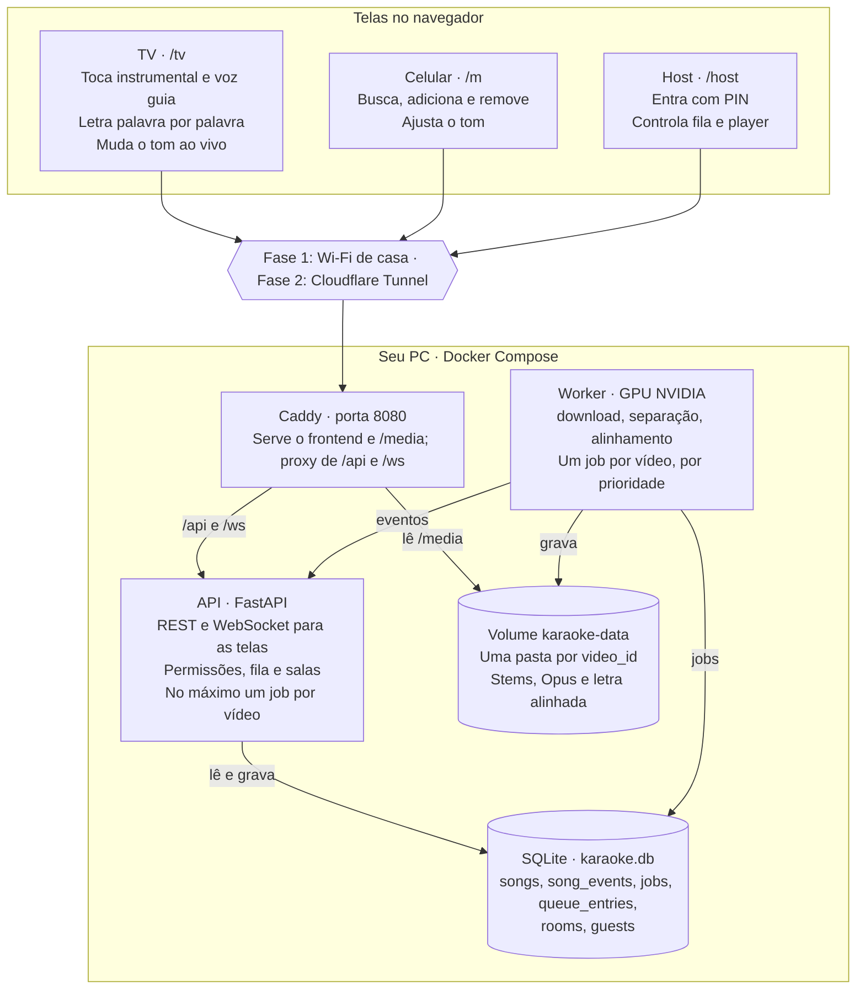
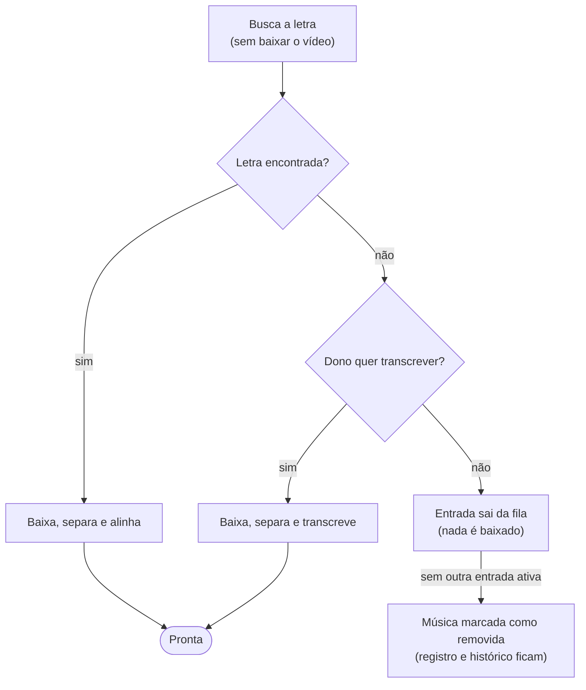

# Arquitetura — App de Karaokê

Atualizado em 1º de outubro de 2026.

## Visão geral

O app é uma aplicação web que roda no seu PC (Windows 11, GPU NVIDIA). Ele busca músicas no YouTube, remove a voz, ajusta o tom e mostra a letra destacada palavra por palavra. A fila é compartilhada e controlada pelo celular via QR Code.

Na fase 1 tudo roda na rede local. Na fase 2 o mesmo PC fica ligado e é exposto pela internet com um túnel, sem mudar a arquitetura.

**Requisitos funcionais**

1. Buscar músicas no YouTube.
2. Baixar o áudio do vídeo.
3. Remover a voz e gerar o instrumental.
4. Mudar o tom em tempo real, de meio em meio tom, durante a música, para se adequar ao cantor. O instrumental é processado uma vez e guardado só no tom original.
5. Obter a letra e sincronizá-la automaticamente, com destaque palavra por palavra.
6. Adicionar músicas à fila. A mesma música pode entrar mais de uma vez.
7. Entrar pelo QR Code para adicionar e remover músicas. Cada convidado só remove o que ele mesmo adicionou.
8. A identidade de uma música é o ID do vídeo no YouTube. Vídeo já processado nunca é reprocessado: áudio e letra vêm do armazenamento local.
9. Quando a letra não é encontrada, o app avisa quem adicionou a música e pergunta se ela deve ser transcrita. Se a resposta for não, nada é processado e a música é marcada como removida, sem apagar o registro, para manter o histórico.

**Requisitos não funcionais**

- Sem custo recorrente: roda no PC pessoal.
- Espera mínima: a música deve estar pronta quando chegar a vez dela.
- Celular sem instalar nada: só navegador e QR Code.
- Mesma base de código para uso local e remoto.

**Fora de escopo na v1:** pontuação de afinação, microfone pelo app (o microfone vai direto na caixa de som ou mesa), vídeo de fundo (descartado, para poupar disco), contas de usuário e mais de um PC.

## Decisões de arquitetura

As escolhas priorizam um único PC com GPU, sem custo recorrente e sem reprocessar nada. Em relação à recomendação inicial, Redis e ARQ saíram: com um PC só, a fila de jobs no próprio banco é mais simples e resolve prioridade e deduplicação.

| # | Decisão | Escolha | Motivo |
| --- | --- | --- | --- |
| 1 | Tipo de app | Web: navegador na TV e no celular | Mesma base local e remota; celular sem instalar nada |
| 2 | Backend | Python 3.12 | yt-dlp, separação de voz, Whisper e Rubber Band são Python ou têm binding Python |
| 3 | Processamento | Worker separado da API | Trabalho de GPU não trava a API; cada um reinicia sozinho |
| 4 | Fila de jobs | Tabela `jobs` no SQLite, sem Redis | Prioridade pela posição na fila do karaokê e deduplicação por `video_id` ficam triviais |
| 5 | Banco | SQLite em modo WAL, via SQLAlchemy | Um arquivo, zero operação; SQLAlchemy deixa a porta aberta para Postgres |
| 6 | Identidade da música | `video_id` do YouTube como chave primária de `songs` | Atende o requisito 8; cache e deduplicação vêm de graça |
| 7 | Quando processar | Assim que a música entra na fila | A espera some, exceto na primeira música da noite |
| 8 | Mudança de tom | Em tempo real, no navegador da TV: Rubber Band compilada para WebAssembly, num AudioWorklet, com o motor R3. O servidor guarda só o tom original | Troca imediata e limpa, de meio em meio tom, sem processar nem guardar uma versão por tom; o R3 soou natural de ouvido e usa ~17% de um núcleo |
| 9 | Sincronização | Com letra sincronizada, o LRC dá o tempo de cada linha, ajustado ao áudio, e o Whisper alinha as palavras dentro de cada linha, sobre a voz isolada | Nenhuma linha fica segundos fora do lugar; foi a única abordagem aprovada de ouvido no spike da fase 0 |
| 10 | Execução | Docker Compose com GPU via WSL2 | Isola CUDA, ffmpeg, Rubber Band e Deno; um comando sobe tudo |
| 11 | Acesso remoto | Cloudflare Tunnel como preferido, com decisão final só na fase 2 (adiada); Tailscale para administrar o PC | Convidados não instalam nada; downloads continuam saindo do IP de casa |
| 12 | Letra ausente | Perguntar ao dono antes de baixar qualquer coisa | Nada pesado roda para uma música que ninguém quer transcrever |
| 13 | Remoção de músicas | Sempre lógica: `status = removed`, arquivos mantidos e eventos em `song_events` | Nada some; a remoção pode ser desfeita sem reprocessar, e fica o histórico de quem recusou ou removeu, e quando |

## Stack tecnológica

O backend inteiro é Python e o frontend é React com TypeScript. Os modelos de separação e alinhamento e suas configurações foram escolhidos no [spike da fase 0](../spikes/phase0/RESULTS.md), medindo qualidade, tempo e VRAM no seu PC, que tem 8 GB de VRAM.

| Camada | Tecnologia | Papel |
| --- | --- | --- |
| Frontend | React + Vite + TypeScript, Tailwind, TanStack Query | Telas `/tv`, `/m` (celular) e `/host` |
| Áudio no navegador | Web Audio API | Toca instrumental e voz guia em sincronia na TV e passa a mistura pelo ajuste de tom |
| QR Code | `qrcode` (npm) | Gerado na própria tela da TV |
| API | FastAPI + Uvicorn, Pydantic v2 | REST e WebSocket |
| Banco | SQLite (WAL) + SQLAlchemy 2 + Alembic | Músicas, fila, convidados e jobs |
| Worker | Python, mesmo pacote da API com outro ponto de entrada | Executa o pipeline |
| Busca e download | [yt-dlp](https://github.com/yt-dlp/yt-dlp) com `yt-dlp[default]`, Deno 2.3+ e ffmpeg | O yt-dlp exige um runtime JavaScript para o YouTube; Deno é o padrão ([EJS](https://github.com/yt-dlp/yt-dlp/wiki/EJS)) |
| Separação de voz | [audio-separator](https://github.com/nomadkaraoke/python-audio-separator) `[gpu]` com BS-RoFormer (`model_bs_roformer_ep_317_sdr_12.9755`), sobreposição 2 e autocast; MelBand RoFormer como alternativa | Gera instrumental e voz em FLAC; ~66 s por música, 2,5 GB de VRAM |
| Letra | [LRCLIB](https://lrclib.net) (gratuita, sem chave); `syncedlyrics` como reserva | Texto da letra e tempos por linha |
| Alinhamento | [stable-ts](https://github.com/jianfch/stable-ts) `model.align()` com Whisper turbo (openai-whisper), sem VAD | Deslocamento e deriva do LRC (música inteira) e tempo de cada palavra (linha a linha); ~26 s por música, 3,9 GB de VRAM |
| Transcrição de reserva | stable-ts com Whisper turbo | Só quando a letra não é encontrada e o dono da entrada autoriza |
| Idioma da letra | [lingua](https://github.com/pemistahl/lingua-py) (`lingua-language-detector`) | Detecta o idioma pelo texto da letra, para o alinhamento |
| Tom | [rubberband-web](https://github.com/delude88/rubberband-web): [Rubber Band](https://breakfastquay.com/rubberband/) em WebAssembly, como AudioWorklet, motor R3 (`setHighQuality(true)`) | Muda o tom ao vivo na TV, de meio em meio tom, de −6 a +6; ~17% de um núcleo e ~77 ms de atraso |
| Detecção de tom | essentia `KeyExtractor` | Mostra o tom original da música |
| Proxy e arquivos | Caddy | Serve o frontend e `/media` com suporte a Range; faz proxy para a API |
| Infra | Docker Compose, Docker Desktop com WSL2 e GPU NVIDIA | Sobe tudo com um comando |
| Acesso remoto | `cloudflared` como serviço do Compose; Tailscale no Windows | Fase 2 |
| Ferramentas | uv, pnpm, pytest, Ruff, Playwright | Dependências, testes e lint |

## Componentes

O sistema tem três telas no navegador e quatro serviços no PC. A API nunca processa áudio: ela registra jobs, e o worker com GPU os executa.



As telas falam só com o Caddy. O worker pega jobs no SQLite por prioridade, grava os arquivos no volume e avisa a API, que repassa o progresso às telas por WebSocket.

**Estrutura do repositório**

```
karaoke-app/
├── compose.yaml
├── .env.example
├── docker/            api.Dockerfile, worker.Dockerfile, Caddyfile
├── backend/           pacote Python (uv)
│   ├── karaoke/
│   │   ├── api/       rotas REST e WebSocket
│   │   ├── core/      config, banco, modelos, permissões
│   │   ├── pipeline/  download, separação, letra, alinhamento, tom original
│   │   ├── worker/    loop de jobs
│   │   └── cli.py     process, rebuild-index
│   └── tests/
├── web/               React + Vite (pnpm), rotas tv, m e host
└── docs/
```

## Pipeline de processamento e cache

Cada `video_id` é processado no máximo uma vez. Tudo o que o pipeline produz fica em `media/<video_id>/` e é reutilizado sempre que o vídeo voltar à fila.

**Ao adicionar uma música à fila**, sempre nasce uma nova entrada, porque repetições são permitidas. O que muda é o trabalho disparado:

| Estado de `songs[video_id]` | O que acontece |
| --- | --- |
| Não existe | Cria a música com status `pending` e um job `process`. O `INSERT ... ON CONFLICT DO NOTHING` garante que só quem inseriu cria o job |
| `pending` ou `processing` | Só cria a entrada; ela acompanha o job que já existe |
| `awaiting_decision` | Cria a entrada, também aguardando decisão, e a pergunta "transcrever?" vai também para o novo dono |
| `ready` | A entrada fica pronta na hora. Nada é baixado nem processado |
| `removed` | A música é reativada. Com os arquivos completos, fica `ready` na hora, sem reprocessar; se nunca foi processada (transcrição recusada), a busca da letra roda de novo. O histórico continua em `song_events` |
| `failed` | A entrada aparece com o erro; o host pode pedir nova tentativa |

**Garantias contra reprocessamento**

- `songs.video_id` é chave primária.
- Um índice único parcial em `jobs (video_id, kind)` para status `pending` ou `running` impede dois jobs iguais ativos ao mesmo tempo.
- Cada etapa registra sua conclusão em `manifest.json`. Se o worker cair no meio, o job retoma da primeira etapa incompleta.
- Reprocessar só acontece por ação explícita do host (por exemplo, trocar a letra) e só nas etapas pedidas.

**Etapas do job `process`.** As etapas 1 e 2 são leves e rodam antes de baixar qualquer coisa. As demais rodam um job por vez. Como a GPU tem 8 GB de VRAM, só o modelo da etapa atual fica carregado.

1. Metadados, sem baixar o vídeo: título, canal, duração, thumbnail e, quando existirem, `track` e `artist` vindos do yt-dlp.
2. Letra: LRCLIB por artista, faixa e duração; depois busca livre com o título limpo; depois `syncedlyrics`. Vence o resultado com duração mais próxima da do vídeo. Sem letra, o job termina aqui e a música passa para `awaiting_decision` (veja abaixo).
3. Download do melhor áudio disponível.
4. Separação: audio-separator, com BS-RoFormer em sobreposição 2 e autocast, gera `instrumental.flac` e `vocals.flac`.
5. Idioma: detectado pelo texto da letra, com lingua; na transcrição, pelo próprio Whisper.
6. Alinhamento, com stable-ts e Whisper turbo, sem VAD, sobre `vocals.flac`. Com letra sincronizada, as linhas seguem o LRC e as palavras são alinhadas linha a linha (veja abaixo). Com letra só em texto, o texto inteiro é alinhado de uma vez. Na transcrição autorizada, o Whisper transcreve a voz e a letra fica marcada como "transcrita". Em todos os casos, grava início, fim e confiança de cada palavra.
7. Tom original: essentia sobre o instrumental.
8. Codificação para reprodução: Opus 160 kbps de cada stem.
9. Pronto: `songs.status = ready` e evento `song.ready` para as telas.

**Letra sincronizada: o LRC como esqueleto.** Alinhar a música inteira de uma vez deixou ~6% das linhas a segundos de onde são cantadas, e a audição reprovou o resultado. Os tempos do LRC também não servem direto: no spike, um clipe estava 5,5 s deslocado da letra e outra letra tinha deriva de 1,2% na velocidade. A solução aprovada de ouvido usa o LRC para as linhas e o Whisper para as palavras:

1. O texto inteiro é alinhado à voz de uma vez, só para medir o deslocamento e a deriva entre o LRC e o áudio. A medida é uma reta robusta: Theil–Sen, refinada sem as linhas a mais de 2 s dela.
2. Cada linha começa no tempo do LRC levado para o áudio por essa reta. Ela termina no tempo seguinte do LRC, contando as linhas vazias, que marcam pausas, e dura no máximo 12 s.
3. As palavras de cada linha são alinhadas pelo stable-ts só dentro da janela da própria linha, com 0,3 s de margem de cada lado. Um erro fica preso naquela linha.
4. Se as palavras de uma linha não alinharem, elas são distribuídas pelo tamanho e a linha fica `low_confidence`.

Isso custa ~19 s a mais por música que alinhar só a música inteira.

**Quando a letra não é encontrada**

O app pergunta antes de baixar qualquer coisa, então nada pesado roda para uma música cuja transcrição ninguém autorizou.

1. A música e as entradas dela passam para `awaiting_decision`. O evento `song.lyrics_missing` chega ao celular de cada dono e ao host.
2. O celular mostra: "Não encontramos a letra desta música. Quer que ela seja transcrita automaticamente? A transcrição pode ter erros." Os botões são **Sim, transcrever** e **Não, remover**.
3. **Sim**, de qualquer dono ou do host: nasce um novo job `process` com transcrição ligada. Pelo `manifest.json` ele pula as etapas 1 e 2 e segue da 3 à 9. Todas as entradas daquele vídeo seguem juntas.
4. **Não**: a entrada de quem respondeu sai da fila como `removed`. Quando o vídeo fica sem nenhuma entrada ativa, a música é marcada como `removed`, e nada é baixado nem processado.
5. Enquanto ninguém responde, a entrada não toca. Quando chega a vez dela, a fila passa para a próxima e ela continua esperando.



Só um "sim" libera o download; um "não" de todos os donos deixa a música como removida sem nenhum processamento.

**Remoção é sempre lógica.** Nenhuma música é apagada: a linha em `songs` fica com `status = removed`, data e motivo, cada passo é registrado em `song_events`, e os arquivos continuam no armazenamento. Assim o host pode desfazer a remoção sem reprocessar nada.

Se a transcrição autorizada falhar, a música fica pronta como "sem letra" e o dono é avisado.

**Tom:** o servidor não processa nem guarda nenhuma versão em outro tom. A mudança de tom acontece ao vivo, na TV (veja o player).

**Prioridade:** o worker pega primeiro o job cuja música está mais perto de tocar; empate vai por ordem de criação.

## Modelo de dados

Seis tabelas no SQLite. `songs` guarda cada vídeo uma única vez e nunca é apagada; `queue_entries` pode apontar várias vezes para o mesmo `video_id`, o que permite músicas repetidas na fila sem duplicar processamento. `song_events` guarda o histórico de cada música.

| Tabela | Chave | Campos principais | Regras |
| --- | --- | --- | --- |
| `songs` | `video_id` (11 caracteres) | `title`, `artist`, `track`, `channel`, `duration_s`, `thumbnail_url`, `status`, `stage`, `original_key`, `language`, `lyrics_source`, `alignment_confidence`, `pipeline_version`, `error`, `created_at`, `ready_at`, `removed_at`, `removed_reason` | Uma linha por vídeo, nunca apagada. `status`: pending, awaiting_decision, processing, ready, failed ou removed. `lyrics_source`: lrclib, syncedlyrics, transcrita, manual ou nenhuma |
| `song_events` | `id` | `video_id`, `kind`, `guest_id` (ou host), `details`, `created_at` | Histórico só de inclusão: criada, letra não encontrada, transcrição aceita ou recusada, pronta, removida, reativada |
| `jobs` | `id` | `kind` (process), `video_id`, `options` (ex.: transcrever), `status`, `stage`, `progress`, `attempts`, `error`, `created_at`, `started_at`, `finished_at` | Índice único parcial impede dois jobs iguais ativos |
| `rooms` | `id` | `code` (vai no QR), `name`, `host_pin_hash`, `is_active`, `created_at` | Uma sala ativa por vez na v1; o modelo já aceita várias |
| `guests` | `id` (UUID) | `room_id`, `nickname`, `token_hash`, `created_at`, `last_seen_at` | O token fica no cookie do celular; o banco guarda só o hash |
| `queue_entries` | `id` | `room_id`, `video_id`, `guest_id` (dono), `singer_name`, `semitones`, `position`, `status`, `removed_reason`, `created_at`, `started_at`, `ended_at` | `semitones`: tom atual em relação ao original, de −6 a +6. `status`: queued, awaiting_decision, playing, done, skipped ou removed. `removed_reason`: dono, host ou transcrição recusada. Remoção é lógica |

O acervo é simplesmente `songs` com `status = ready`. A busca usa esse acervo para marcar os resultados que já tocam na hora. Músicas removidas ficam fora do acervo, mas continuam no banco.

## Armazenamento local

Cada vídeo tem uma pasta própria, nomeada pelo `video_id`, com tudo o que é preciso para tocar sem reprocessar: áudio original, stems, versões de reprodução e letra alinhada.

```
data/                         volume Docker "karaoke-data"
├── karaoke.db                SQLite (WAL)
├── models/                   modelos baixados uma vez (BS-RoFormer, Whisper), ~5 GB
└── media/
    └── <video_id>/
        ├── manifest.json     etapas concluídas, modelos e versões usados
        ├── source.<ext>      áudio original baixado
        ├── thumb.jpg
        ├── stems/
        │   ├── instrumental.flac
        │   └── vocals.flac
        ├── play/
        │   ├── instrumental.opus
        │   └── vocals.opus
        └── lyrics/
            ├── source.json   letra original e de onde veio
            └── aligned.json  linhas → palavras com início, fim e confiança
```

Formato de `aligned.json` (tempos em segundos):

```json
{"version": 1, "language": "pt", "source": "lrclib",
 "lines": [{"start": 12.34, "end": 15.80, "low_confidence": false,
            "words": [{"w": "palavra", "s": 12.34, "e": 12.90, "c": 0.93}]}]}
```

`low_confidence` marca as linhas cujas palavras não puderam ser alinhadas e foram distribuídas pelo tamanho.

**Regras**

- Escrita atômica: cada arquivo é gravado como `.tmp` e renomeado. A pasta só vale como pronta quando o `manifest.json` diz.
- Volume Docker nomeado, no disco ext4 do WSL2, em vez de uma pasta do Windows. É mais rápido e diferencia maiúsculas de minúsculas: IDs do YouTube diferenciam, o NTFS não, e dois vídeos poderiam cair na mesma pasta.
- O armazenamento é autossuficiente: um comando `rebuild-index` recria a tabela `songs` a partir dos manifests.
- Só o tom original é guardado; a mudança de tom acontece ao vivo, na TV.
- Música marcada como removida mantém todos os arquivos, para que a remoção possa ser desfeita sem reprocessar.
- Backup por script que compacta o volume.

**Espaço estimado** para uma música de 4 minutos: cerca de 65 MB (original ~4 MB, dois FLAC ~25 MB cada, dois Opus ~5 MB cada), em qualquer tom. Mil músicas ocupam perto de 65 GB, além de ~5 GB fixos dos modelos em `models/`.

## Salas, QR Code, convidados e permissões

Convidados entram pelo QR Code sem criar conta. O servidor dá a cada celular um token anônimo, e cada entrada da fila guarda quem a criou. Só o dono e o host podem removê-la.

**Como alguém entra**

1. O host abre `/host`, entra com o PIN definido no `.env` e abre a sala da noite.
2. A TV abre `/tv` e mostra o QR com `<origem>/j/<código da sala>`. A origem é a URL pela qual a TV foi aberta; se for `localhost`, usa `PUBLIC_BASE_URL` (IP da rede local ou domínio do túnel).
3. O celular abre o link, informa um apelido e chama `POST /api/rooms/{code}/join`.
4. O servidor gera um token aleatório de 32 bytes, guarda só o hash em `guests` e devolve o token num cookie `HttpOnly` e `SameSite=Lax` (mais `Secure` quando via HTTPS).
5. Toda ação do celular leva o cookie. O servidor descobre o `guest_id` por ele e checa a permissão. IDs de dono enviados pelo cliente nunca são confiados.

**Matriz de permissões**

| Ação | Dono da entrada | Outro convidado | Host |
| --- | --- | --- | --- |
| Buscar e adicionar música | Sim | Sim | Sim |
| Remover entrada da fila (se estiver tocando, pula) | Sim | Não | Sim |
| Mudar o tom da entrada | Sim | Não | Sim |
| Responder se a letra deve ser transcrita | Sim | Não | Sim |
| Reordenar a fila | Não | Não | Sim |
| Tocar, pausar, pular | Não | Não | Sim |
| Ajustar voz guia e atraso da TV | Não | Não | Sim |
| Trocar letra ou reprocessar etapas | Não | Não | Sim |
| Marcar música do acervo como removida | Não | Não | Sim |
| Desfazer a remoção de uma música | Não | Não | Sim |

A regra mora numa única função `can(ator, ação, entrada)`, chamada por todas as rotas e coberta por testes linha a linha desta matriz.

**Casos de borda**

- Convidado que limpa o navegador vira um convidado novo e perde a posse das entradas antigas; o host remove por ele.
- O código da sala muda a cada nova sessão, então um QR antigo para de funcionar. Na internet, isso impede que estranhos entrem.

## Player da TV e letra palavra por palavra

A TV é dona da reprodução. Ela toca os dois stems com a Web Audio API, desenha a letra a partir do relógio do áudio e informa ao servidor o que está tocando. A tela é um navegador de PC, notebook ou mini-PC ligado à TV; navegadores de smart TV não são alvo na v1.

**Áudio**

- Instrumental e voz tocam em dois `AudioBufferSourceNode` iniciados no mesmo instante do `AudioContext`, com sincronia exata entre eles.
- A voz passa por um `GainNode`: a "voz guia" vai de 0 a 100%, padrão 0.
- A próxima música é baixada e decodificada enquanto a atual toca, então a troca é imediata.
- Memória: um stem estéreo de 4 minutos decodificado ocupa cerca de 92 MB; com dois stems e a próxima música, perto de 370 MB.
- O navegador exige um clique antes de tocar áudio. A TV mostra um botão "Iniciar" uma vez por sessão.

**Letra**

- Relógio: `t = ctx.currentTime − início − atraso`, recalculado a cada quadro com `requestAnimationFrame`. O `atraso` soma `ctx.outputLatency` e um ajuste manual, porque caixas Bluetooth atrasam o som.
- Tela: linha atual grande e a próxima menor, abaixo.
- A linha aparece até 1 s antes de ser cantada, assim que a anterior termina, para dar tempo de ler.
- Cada palavra se preenche da esquerda para a direita na proporção `(t − s) / (e − s)`, o efeito clássico de karaokê.
- Antes de uma linha que vem depois de 3 s ou mais sem canto, aparece uma contagem regressiva (● ● ●).
- Linha marcada com `low_confidence`, ou com confiança baixa nas palavras, acende inteira no início, em vez de preencher palavra por palavra errado.
- Música sem letra mostra título e "Instrumental".

**Tom**

- O tom muda em tempo real, durante a música, de meio em meio tom, de −6 a +6 semitons. Nada é processado nem guardado no servidor: a TV passa o áudio por um AudioWorklet com a Rubber Band (rubberband-web), no motor R3.
- Instrumental e voz guia são misturados antes e passam por um único ajuste de tom, o que corta o custo de CPU pela metade.
- Controles de tom: botão **−½ tom**, botão **+½ tom** e botão **voltar ao tom original**. Eles ficam no celular do dono da entrada, na tela do host e na própria TV.
- O tom atual fica sempre visível na TV e nos controles, em nome e em semitons: "Tom: Sol menor (−2) · original: Lá menor".
- O tom pode já vir escolhido do celular, ao adicionar a música; é o tom em que ela começa.
- A Rubber Band muda o tom sem mudar a duração, então os tempos da letra continuam válidos em qualquer tom. O atraso do próprio processamento (~77 ms com o R3) entra no `atraso` do relógio da letra.

**Entre músicas**, a TV mostra o próximo cantor, a música, o tom e o QR Code, e a próxima começa sozinha depois de uma contagem curta. O host pode pausar ou pular. Se a próxima ainda estiver processando, a contagem espera ela ficar pronta; entradas aguardando a decisão de transcrever são puladas.

## API REST e eventos em tempo real

Comandos vão por REST; mudanças de estado voltam para todas as telas por WebSocket. Toda rota resolve o ator pelo cookie (convidado ou host) antes de checar a permissão.

| Método e rota | Quem pode | O que faz |
| --- | --- | --- |
| `GET /api/search?q=` | Convidado | Busca no YouTube via yt-dlp; cada resultado traz `in_library`. Cache de 10 minutos por termo |
| `POST /api/rooms/{code}/join` | Quem tem o código | Cria o convidado e devolve o cookie |
| `GET /api/rooms/{code}/queue` | Convidado | Fila atual |
| `POST /api/rooms/{code}/queue` | Convidado | Adiciona `{video_id, singer_name, semitones}` |
| `PATCH /api/rooms/{code}/queue/{id}` | Dono (tom) ou host (tom e posição) | Altera a entrada |
| `DELETE /api/rooms/{code}/queue/{id}` | Dono ou host | Remove a entrada (remoção lógica) |
| `POST /api/rooms/{code}/queue/{id}/transcription` | Dono ou host | Responde à pergunta: `{"accept": true}` transcreve; `false` remove a entrada |
| `GET /api/songs/{video_id}` | Convidado | Status, metadados, tom original e URLs de mídia |
| `GET /api/library?q=` | Convidado | Acervo de músicas prontas; removidas ficam de fora |
| `POST /api/host/login` | Qualquer um | Troca o PIN por um cookie de host |
| `POST /api/rooms` | Host | Abre a sala da noite e gera o código |
| `POST /api/rooms/{code}/player/{ação}` | Host | play, pause ou skip |
| `PUT /api/songs/{video_id}/lyrics` | Host | Troca a letra e realinha |
| `POST /api/songs/{video_id}/reprocess` | Host | Reprocessa as etapas escolhidas |
| `DELETE /api/songs/{video_id}` | Host | Marca a música como removida; registro, arquivos e histórico ficam |
| `POST /api/songs/{video_id}/restore` | Host | Desfaz a remoção usando os arquivos guardados, sem reprocessar |
| `GET /api/songs/{video_id}/history` | Host | Eventos da música em `song_events` |
| `GET /media/{video_id}/...` | TV | Áudio e letra, servidos pelo Caddy com Range |
| `POST /internal/events` | Worker | Progresso dos jobs. Não é exposto pelo Caddy |

**WebSocket** em `/ws/rooms/{code}`, autenticado pelo mesmo cookie:

| Evento | Direção | Conteúdo |
| --- | --- | --- |
| `queue.snapshot` | Servidor → todos | Fila completa, na conexão e a cada mudança. A fila é pequena, e mandar tudo evita bugs de sincronização |
| `song.progress` | Servidor → todos | `video_id`, etapa e percentual |
| `song.lyrics_missing` | Servidor → donos e host | `video_id` e as entradas que aguardam a decisão de transcrever |
| `song.ready` / `song.failed` | Servidor → todos | `video_id` e erro, quando houver |
| `player.command` | Servidor → TV | play, pause, skip, voz guia, atraso e tom (−½, +½ ou original) |
| `player.state` | TV → servidor → todos | Entrada atual, posição, pausa e tom atual, a cada segundo |

Ao cair a conexão, o cliente reconecta com espera crescente e recebe um `queue.snapshot` novo.

## Implantação local e acesso remoto

Tudo roda em Docker Compose no seu PC, e só o Caddy fica exposto. O acesso remoto é um serviço a mais no mesmo Compose, sem mudar código.

| Serviço | Base | Exposição | Observação |
| --- | --- | --- | --- |
| `caddy` | `caddy:2` | Porta 8080 do PC | Serve o frontend e `/media`; faz proxy de `/api` e `/ws` |
| `api` | `python:3.12-slim` | Interna | Sem PyTorch, imagem leve |
| `worker` | Imagem PyTorch com CUDA, ffmpeg e Deno | Nenhuma | `gpus: all`; um job por vez |
| `cloudflared` | `cloudflare/cloudflared` | Nenhuma | Só no perfil `remote` |

O volume `karaoke-data` é montado na API e no worker com escrita, e no Caddy só para leitura de `media/`.

**Fase 1: rede local**

- No Windows: driver NVIDIA atualizado, Docker Desktop com backend WSL2 (a GPU chega aos containers por ele) e regra no Firewall liberando a porta 8080 na rede privada.
- Reserve o IP do PC no roteador, para o QR Code não mudar.
- `.env` com `HOST_PIN`, `PUBLIC_BASE_URL=http://<IP do PC>:8080` e os modelos escolhidos.
- `docker compose up -d` sobe tudo; a TV abre `http://<IP do PC>:8080/tv`.
- Desenvolvimento: `pnpm dev` fora do Docker, com proxy para a API, que roda com recarga automática.
- Sem HTTPS na rede local o celular não instala o app como PWA, mas o site funciona normalmente.

**Fase 2: acesso de qualquer lugar (adiada)**

A fase 2 não será executada agora. Cloudflare Tunnel é a opção preferida; a escolha final entre ele e o Tailscale Funnel fica para quando a fase começar.

- `docker compose --profile remote up -d` liga o `cloudflared`, que publica `https://karaoke.<seu-domínio>` sem abrir portas no roteador. Requer um domínio gerenciado na Cloudflare.
- Alternativa sem domínio: Tailscale Funnel, que dá uma URL pública `*.ts.net`.
- O Tailscale comum fica só para você administrar o PC, porque os celulares dos convidados não estão na sua rede Tailscale.
- `PUBLIC_BASE_URL` passa a ser o domínio. Com HTTPS, o cookie ganha `Secure` e o PWA passa a funcionar.
- Proteção: PIN do host forte com limite de tentativas, limite de buscas por convidado, `/media` exigindo cookie de sala válido (`forward_auth` do Caddy na API) e `/internal` nunca exposto.
- PC sempre pronto: suspensão desativada no plano de energia, Docker Desktop iniciando com o Windows e containers com `restart: unless-stopped`.

## Riscos e mitigações

O maior risco é o YouTube quebrar o yt-dlp. Como tudo que já foi processado fica no disco, uma quebra só afeta músicas novas.

| Risco | Impacto | Mitigação |
| --- | --- | --- |
| YouTube muda e o yt-dlp para de funcionar | Novas músicas não baixam | Atualizar `yt-dlp` e `yt-dlp-ejs` juntos, com um comando de atualização no worker; o acervo continua tocando |
| Letra não encontrada, comum em músicas brasileiras menos conhecidas | Sem destaque de palavras | O dono decide se a letra é transcrita; se recusar, nada é baixado e a música fica como removida. O host também pode colar a letra e realinhar |
| Letra errada (cover, outra versão, outra música) | Destaque sem sentido | Escolha pela duração mais próxima; host troca a letra e só o alinhamento roda de novo |
| Alinhamento falha em trechos lentos, gritos, backing vocals ou linhas muito curtas (~6% das linhas no spike, alinhando a música inteira) | Linhas e palavras fora de hora | Com letra sincronizada, as linhas seguem o LRC e as palavras são alinhadas linha a linha; sem ela, linhas com confiança baixa acendem inteiras |
| VRAM insuficiente para separação e Whisper juntos | Erro de memória na GPU | A GPU tem 8 GB: o worker carrega um modelo por vez e libera a VRAM entre a separação e o alinhamento; modelos escolhidos pelo spike |
| Atraso de caixa Bluetooth | Letra adiantada em relação ao som | Ajuste manual de atraso na TV, salvo no navegador |
| Disco enche (~65 MB por música) | Falha ao gravar | Aviso no painel do host. Removidas continuam ocupando espaço, porque os arquivos são mantidos |
| Tom em tempo real pesa na CPU do PC da TV | Áudio picotando | Validado no spike: o R3 usa ~17% de um núcleo de um i5-12400F, e uma só mistura passa pelo ajuste. O PC ligado à TV precisa de CPU de desktop; numa máquina fraca, o R2 usa metade disso |
| Licença GPL da Rubber Band, entregue ao navegador | Restrição se o app for distribuído | Uso privado não é afetado; distribuir o app exigiria licença compatível ou a licença comercial da Rubber Band |
| PC desligado ou dormindo | App fora do ar na fase 2 | Plano de energia e reinicialização automática dos containers |
| Termos do YouTube e direitos das letras | Risco legal ao abrir o acesso | Uso privado: sala com código, `/media` protegido, nada indexado |

## Roteiro de implementação

Sete fases, cada uma com um critério de pronto verificável. A fase 0 vem antes de qualquer código do app, porque escolhe os modelos que o resto usa.

0. **Spike de viabilidade:** concluída em 1º de outubro de 2026 ([resultados](../spikes/phase0/RESULTS.md)).
    - Separação: BS-RoFormer com sobreposição 2 e autocast, ~66 s por música.
    - Letra: LRC como esqueleto das linhas e Whisper turbo para as palavras, linha a linha.
    - Tom: Rubber Band R3 em arquivo, depois substituído pelo tom em tempo real no navegador (decisão 8).
    - Tempo total: ~111 s por música, somando as etapas medidas, cerca de 39% da duração da música.
1. **Pipeline em linha de comando:** concluída em 1º de outubro de 2026. `karaoke process <video_id>` gera a pasta completa.
    - Pronto quando: a segunda execução termina sem usar a GPU, e uma execução interrompida retoma de onde parou.
    - Verificado: a segunda execução levou 0,9 s num container sem acesso à GPU; depois de um `docker kill` no meio da separação, a nova execução retomou na separação. Cerca de 80 a 130 s por música.
2. **API, banco e worker:** concluída em 1º de outubro de 2026. Tabelas, jobs com prioridade, busca, rotas de música e Compose com GPU.
    - Pronto quando: adicionar o mesmo vídeo cinco vezes ao mesmo tempo gera um único job.
    - Verificado: cinco celulares adicionaram o mesmo vídeo novo ao mesmo tempo, pelo Caddy, e nasceram cinco entradas e um único job; o worker processou a música na GPU em ~107 s. Remover e alterar entradas, a resposta sobre a transcrição e o WebSocket ficam na fase 4; as rotas do host para músicas, na fase 5.
3. **Player da TV:** dois stems na Web Audio API, letra palavra por palavra, voz guia, atraso e tom em tempo real (−½, +½ e voltar ao original, com o tom atual visível).
    - Pronto quando: uma música inteira toca com a letra em sincronia, e o tom muda ao vivo, de meio em meio tom, sem cortar o áudio nem dessincronizar a letra.
4. **Fila, sala, QR e permissões:** tela do celular, convidados, WebSocket e testes da matriz.
    - Pronto quando: dois celulares usam a fila, e um não consegue remover a música do outro. Uma música sem letra pergunta ao dono, e um "não" tira a entrada da fila sem baixar nada.
5. **Acabamento:** acervo, troca de letra e reprocessamento pelo host, painel de jobs e de disco, tela entre músicas.
    - Pronto quando: uma noite inteira roda sem precisar abrir o terminal.
6. **Acesso remoto (adiada; não será executada agora):** perfil `remote` com Cloudflare Tunnel, HTTPS, proteção de `/media` e limites de uso.
    - Pronto quando: um celular no 4G entra pelo QR e canta, e o QR de uma sala antiga não funciona.

## Questões em aberto

Todas foram respondidas, exceto a escolha do túnel, que fica para quando a fase 2 começar.

- [x] Ordem da fila: chegada pura, ou rodízio por cantor, em que ninguém canta duas vezes antes de todos cantarem uma? Decisão: chegada pura.
- [x] Limite de músicas pendentes por convidado? Decisão: sem limite.
- [x] A próxima música começa sozinha ou sempre pelo host? Decisão: começa sozinha.
- [ ] Fase 2 com domínio próprio na Cloudflare ou com Tailscale Funnel? Cloudflare é a preferida, mas a decisão fica para quando a fase 2 começar. A fase 2 não será executada agora.
- [x] Quantos GB de VRAM a GPU tem? Decisão: 8 GB, então o worker carrega um modelo por vez.
- [x] Vídeo original sem som ao fundo da letra numa v2? Decisão: não, para poupar o armazenamento local.
- [x] Ao marcar uma música como removida, apagar os áudios ou mantê-los? Decisão: manter, para poder desfazer a remoção sem reprocessar.
- [x] Prazo para responder se a letra deve ser transcrita? Decisão: sem prazo; a entrada espera e não toca.

## Fontes

- [yt-dlp: runtime JavaScript (EJS)](https://github.com/yt-dlp/yt-dlp/wiki/EJS)
- [audio-separator](https://github.com/nomadkaraoke/python-audio-separator)
- [stable-ts](https://github.com/jianfch/stable-ts)
- [LRCLIB](https://lrclib.net)
- [Rubber Band: opções da linha de comando](https://breakfastquay.com/rubberband/usage.txt)
